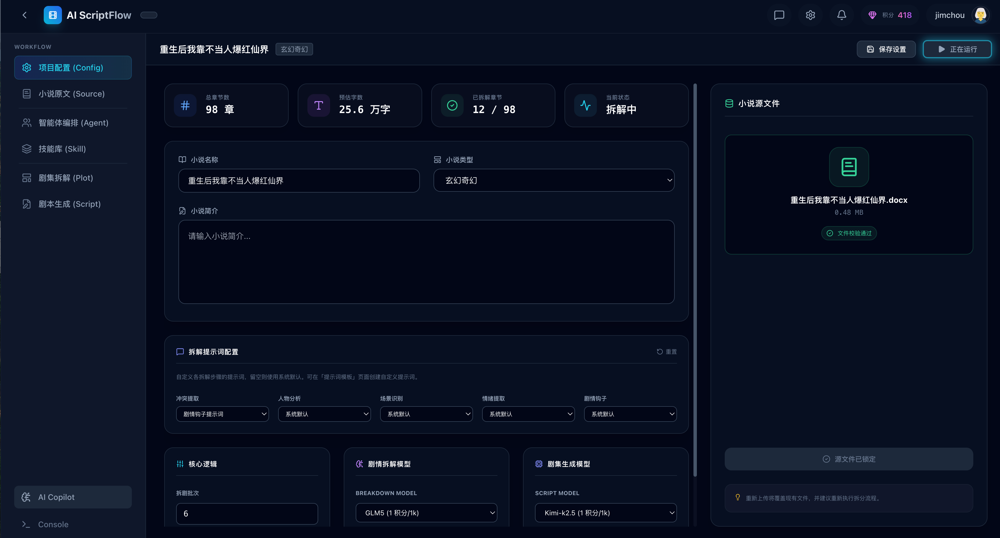
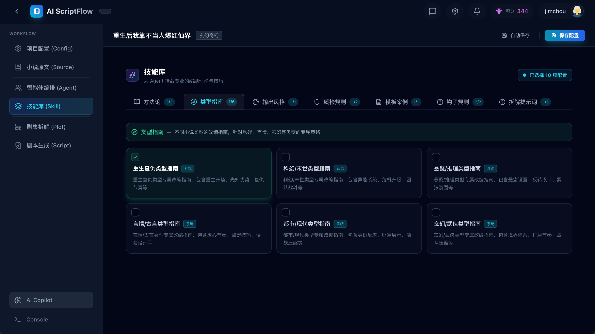
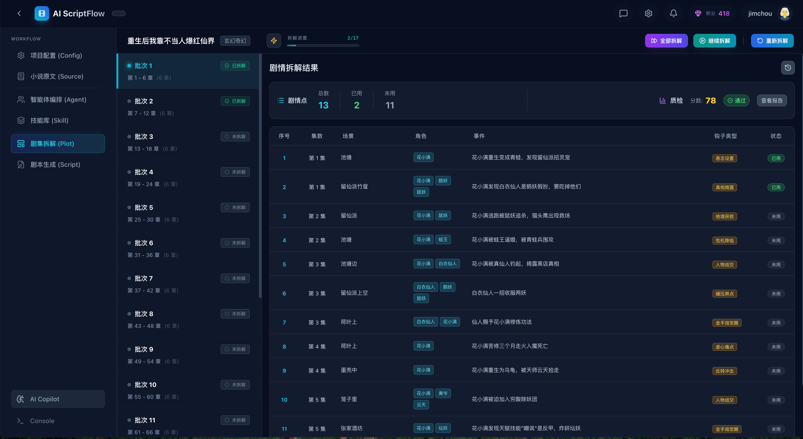
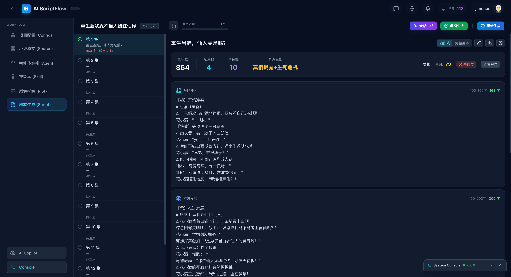
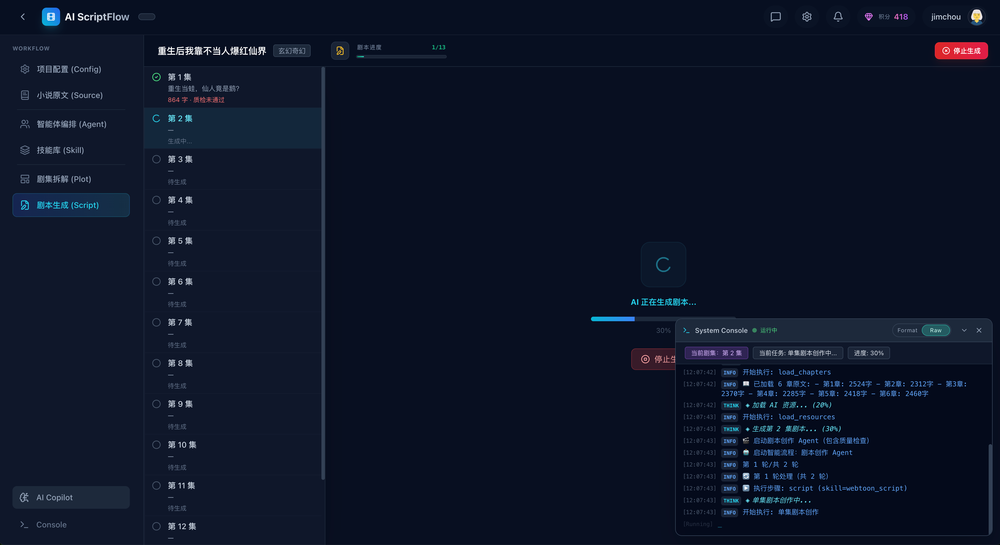
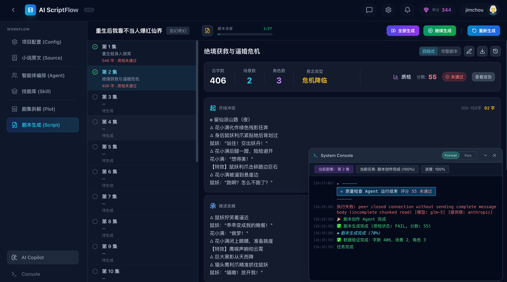
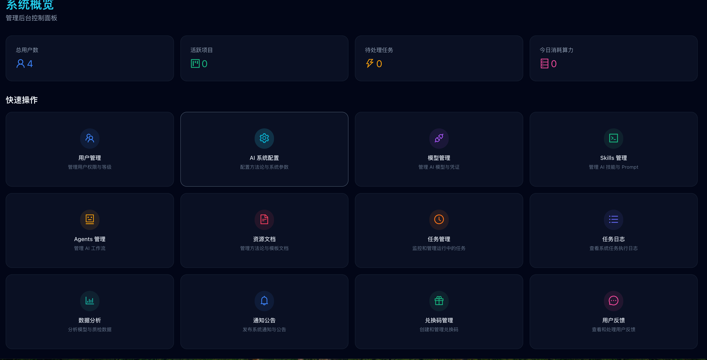

# ScriptForge

**AI-Powered Novel to Script Adaptation Platform**

English | [简体中文](./README_CN.md)

一款基于 AI 的小说改编剧本系统，让用户能够将上传的小说文件，通过批次处理和两阶段 AI 工作流（剧情拆解 → 剧本生成），自动改编成符合影视剧本标准的剧集。

## 📸 功能截图

### 项目首页


展示项目的整体信息，包括项目列表、统计数据和快速操作入口。

### 项目工作台/配置


项目管理界面，支持章节划分、批次配置和实时进度监控。

### 剧情拆解


AI 自动分析小说内容，提取冲突点、人物关系、场景等关键剧情要素。

### 剧本生成
<div style="display: flex; gap: 10px;">



</div>

根据剧情拆解结果，AI 生成符合影视标准的剧本内容，包括场景描述、对话和动作指导。

### 后台管理


系统管理功能，包括用户管理、模型配置和系统监控。

## ✨ 核心特性

- 🤖 **AI 驱动**：基于 LangChain + LangGraph 的智能工作流
- 📝 **两阶段处理**：剧情拆解 → 剧本生成，确保质量
- ✅ **自动质检闭环**：集成 AI 质检器（Breakdown Aligner + Webtoon Aligner），自动检测问题并触发修正循环
- 🔄 **批次处理**：支持大型小说分批次自动处理
- 📊 **配置化设计**：Skills、Agents、Pipelines 均可动态配置
- 🔍 **多维度质量检查**：剧情还原度、连贯性、节奏控制、视觉化风格等 7+ 维度

## 🛠️ 技术栈

### 后端
- Python 3.11+
- FastAPI (Web框架)
- SQLAlchemy 2.0 (ORM)
- PostgreSQL 15+ (数据库)
- Redis (缓存和任务队列)
- Celery (异步任务)
- LangChain + LangGraph (AI工作流)

### 前端
- React 18
- TypeScript
- Vite
- Tailwind CSS
- Ant Design

### 基础设施
- Docker & Docker Compose
- MinIO (对象存储)
- Alembic (数据库迁移)

## 🚀 快速开始

### 1. 克隆项目

```bash
git clone https://github.com/your-username/scriptforge.git
cd scriptforge
```

### 2. 启动开发环境

```bash
# 启动 Docker 服务（PostgreSQL, Redis, MinIO）
docker-compose up -d

# 等待服务启动完成
docker-compose ps
```

### 3. 配置后端

```bash
cd backend

# 复制环境变量配置
cp .env.example .env

# 编辑 .env 文件，填入必要的配置（如 OpenAI API Key）
# vim .env

# 创建虚拟环境
python -m venv venv
source venv/bin/activate  # Windows: venv\Scripts\activate

# 安装依赖
pip install -r requirements.txt

# 运行数据库迁移
alembic upgrade head

# 启动后端服务
uvicorn app.main:app --reload --host 0.0.0.0 --port 8000
```

后端服务将在 http://localhost:8000 启动
API 文档：http://localhost:8000/docs

### 4. 配置前端

```bash
cd frontend

# 安装依赖
npm install

# 启动开发服务器
npm run dev
```

前端服务将在 http://localhost:5173 启动

### 5. 启动 Celery Worker

```bash
cd backend

# 启动 Celery Worker
celery -A app.core.celery_app worker --loglevel=info
```

## 📖 核心功能

### 用户端功能

1. **项目管理**
   - 创建项目并上传小说文件
   - 自动章节识别和批次划分
   - 项目统计信息展示

2. **剧情拆解（Breakdown）**
   - 提取冲突点
   - 识别剧情钩子
   - 分析人物关系
   - 识别场景
   - 提取情绪点

3. **剧本生成（Script）**
   - 规划剧集结构
   - 生成场景描述
   - 编写对话
   - 格式化剧本

4. **导出功能**
   - 单集导出（PDF）
   - 批量打包导出

### 管理端功能

1. 用户管理
2. 系统统计
3. 模型配置管理

## 📚 文档

完整文档请查看：[docs/README.md](./docs/README.md)

### 核心文档

| 文档 | 说明 |
|------|------|
| [架构文档](./docs/ARCHITECTURE.md) | 系统架构、流程图、质检系统详解 |
| [快速开始指南](./docs/01-getting-started/quickstart.md) | 5-10 分钟快速上手 |
| [系统流程规范](./docs/02-specifications/workflow.md) | 系统工作流程 |
| [配置驱动规范](./docs/02-specifications/config-driven.md) | 配置化设计 |
| [数据存储规范](./docs/02-specifications/storage-contract.md) | 数据与文件关系 |

## 📁 项目结构

```
scriptforge/
├── backend/                 # FastAPI 后端
│   ├── app/
│   │   ├── api/v1/        # API 路由
│   │   ├── ai/            # AI 工作流 (LangGraph)
│   │   │   ├── skills/    # Skills 技能库
│   │   │   ├── agents/    # 可配置 Agent
│   │   │   └── graph/     # 工作流状态机
│   │   ├── models/        # SQLAlchemy 模型
│   │   └── core/          # 核心配置
│   └── alembic/           # 数据库迁移
├── frontend/               # React 前端
│   └── src/
│       ├── pages/         # 页面组件
│       ├── components/    # 公共组件
│       └── context/       # 状态管理
└── docs/                  # 项目文档
```

## 🤝 贡献

欢迎贡献！请查看 [CONTRIBUTING.md](./CONTRIBUTING.md) 了解如何参与开发。

## 📄 许可证

本项目采用 GNU Affero General Public License v3.0 许可证 - 详见 [LICENSE](./LICENSE) 文件。

## 🙏 致谢

- [LangChain](https://github.com/langchain-ai/langchain)
- [FastAPI](https://fastapi.tiangolo.com/)
- [React](https://react.dev/)

---

**ScriptForge** - 将小说转化为专业剧本的 AI 助手