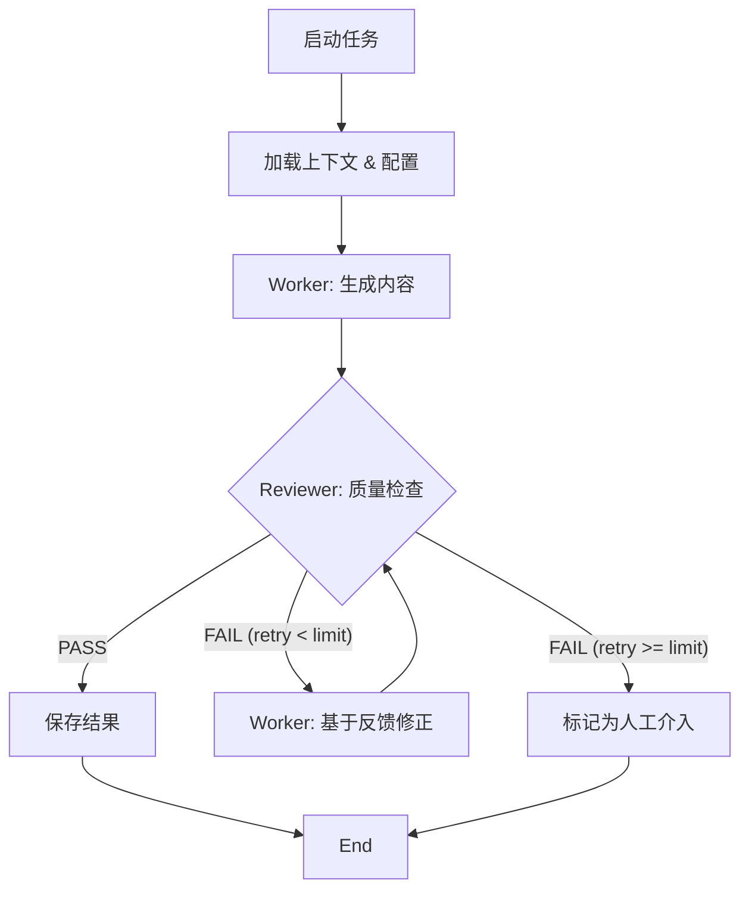

# AI Engine Architecture: Orchestrator-Worker-Reviewer (OWR)

## 1. 核心理念
本系统采用 **Orchestrator-Worker-Reviewer (OWR)** 架构，旨在实现网文改编漫剧的高质量自动化生产。通过引入"双重质量把关"和"自动修正闭环"，模拟人类编辑团队的工作流。

### 角色定义
1.  **Orchestrator (编排者)**: 负责任务调度、上下文管理及工作流控制（对应 LangGraph Workflow）。
2.  **Worker (执行者)**: 负责具体的内容生成任务（如剧情拆解 `BreakdownGenerationSkill`、剧本创作 `WebtoonGenSkill`）。
3.  **Reviewer (质检员)**: 负责对 Worker 的产出进行严格质检，输出结构化反馈（如 `BreakdownAlignerSkill`, `WebtoonAlignerSkill`）。

---

## 2. 动态配置层 (Dynamic Configuration)

为了支持多样化的改编风格和灵活的质检标准，系统配置不再硬编码，而是动态注入。

### 2.1 改编方法论 (Adapt-Method)
用户可以自定义或选择不同的改编方法论（如“快节奏爽文”、“细腻情感风”）。
*   **存储**: 数据库 `configurations` 表或 `knowledge` 表。
*   **结构**:
    ```json
    {
      "name": "Standard Webtoon Adaptation",
      "rules": {
        "episode_length": "500-800 words",
        "conflict_density": "High (1 per 300 words)",
        "hook_requirement": "Must end with a cliffhanger"
      },
      "prompts": {
        "breakdown_system_prompt": "...",
        "script_system_prompt": "..."
      }
    }
    ```

### 2.2 质检员配置 (Reviewer Config)
用户可调整质检的严格程度和关注维度。
*   **结构**:
    ```json
    {
      "strictness": "High", // Low, Medium, High
      "enabled_checks": ["conflict_density", "pacing", "visual_translatability"],
      "auto_fix_limit": 3 // 最大自动修正次数
    }
    ```

---

## 3. 工作流闭环 (Feedback Loop)

系统不再是单向的“输入->输出”，而是包含反馈回路的循环图。



### 关键流程
1.  **Generation**: Worker 根据 Adapt-Method 生成初稿。
2.  **Alignment**: Reviewer 根据 Adapt-Method 的规则对初稿进行评分（Pass/Fail）并生成 `issues` 列表。
3.  **Self-Correction**: 如果 Fail，Orchestrator 将 `issues` 反馈给 Worker，要求其针对性修改。
4.  **Human Handoff**: 超过重试次数仍不达标，通过 `qa_status: review_needed` 引入人工干预。

---

## 4. 数据模型变更

### PlotBreakdown
新增字段以支持 OWR 流程：
*   `qa_status`: `pass` | `fail` | `review_needed`
*   `qa_report`: 存储详细的 Reviewer 反馈（JSONB）。
*   `consistency_score`: 质量评分（0-100）。
*   `used_config_snapshot`: 记录生成时使用的配置快照，确保可追溯。

---

## 5. 实施路线图

1.  **Backend**:
    *   实现 `BreakdownAlignerSkill`。
    *   重构 `breakdown_workflow` 引入条件边和循环。
    *   创建配置管理 API。
2.  **Frontend**:
    *   增加“AI 配置”页面，允许用户编辑 Adapt-Method 和 Reviewer 设置。
    *   在任务详情页展示 QA 报告和修正过程。
