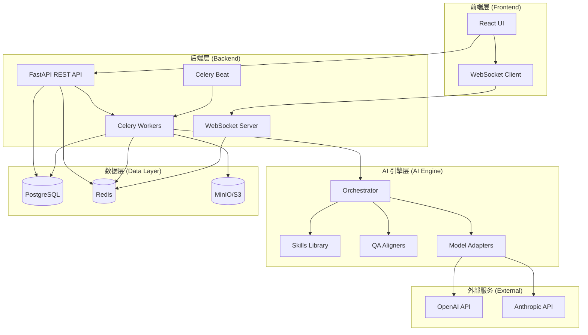
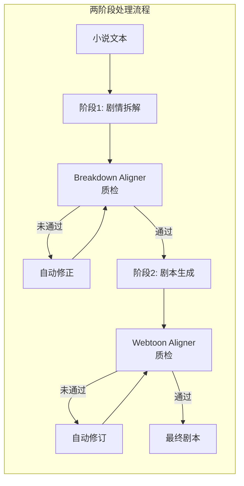
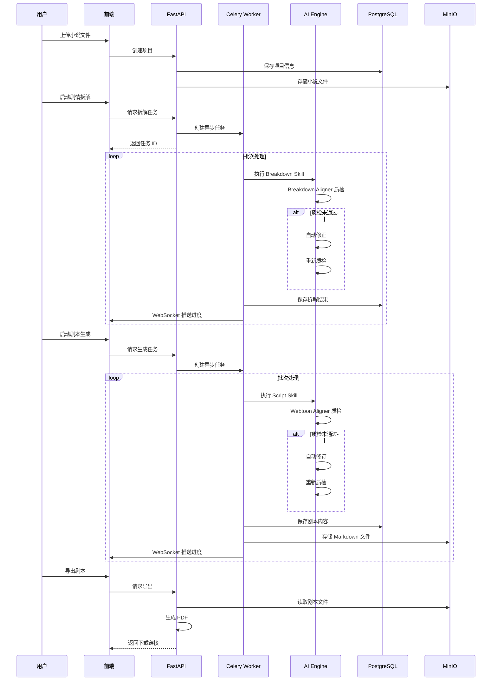
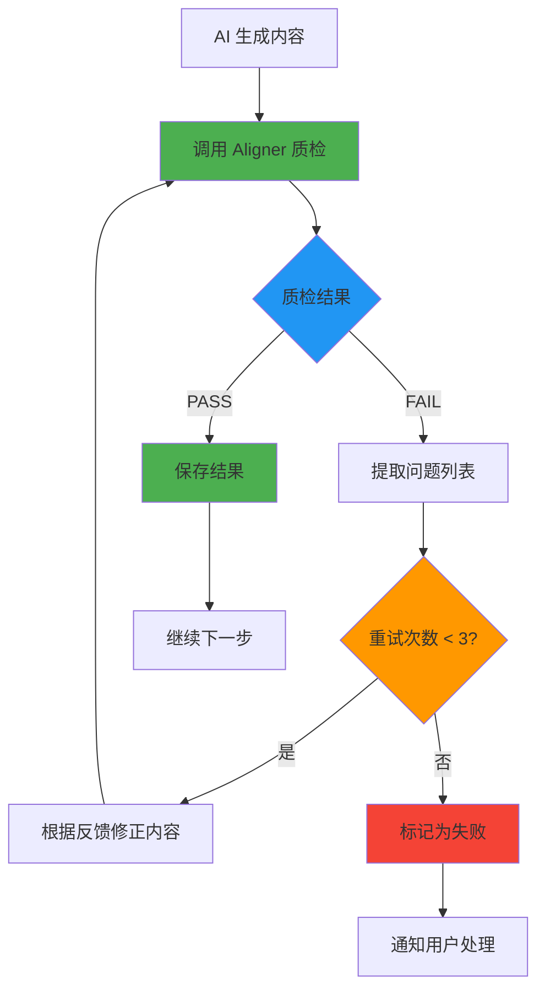
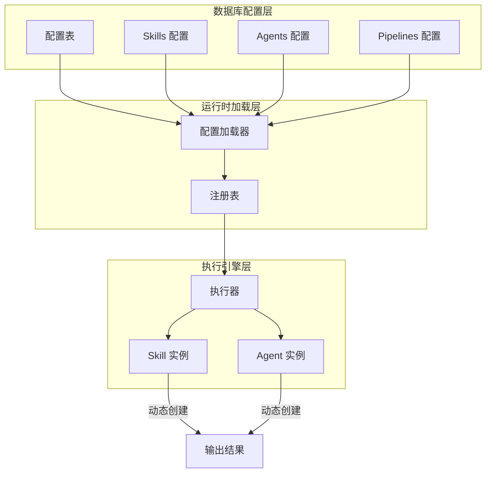
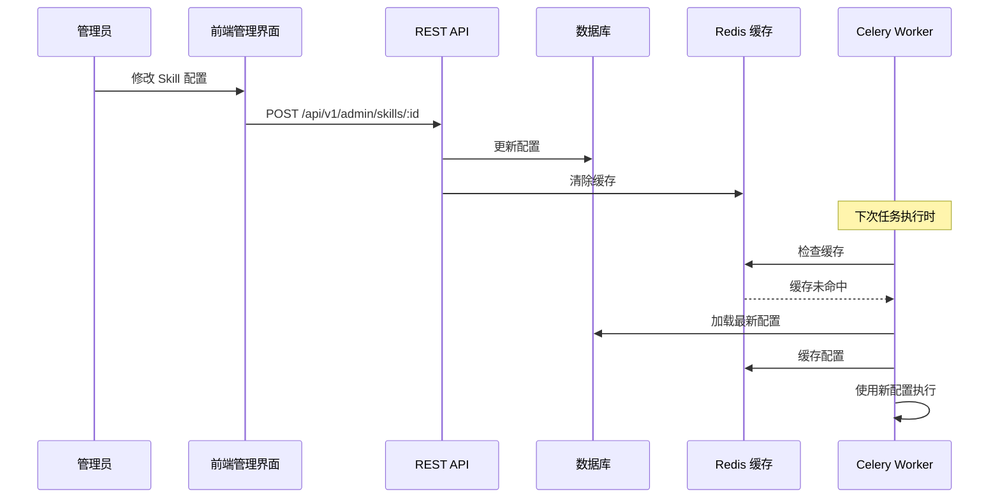
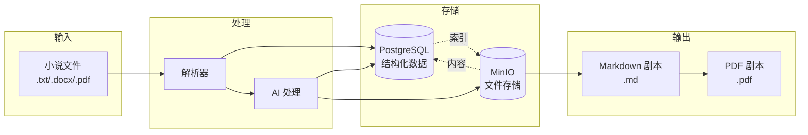
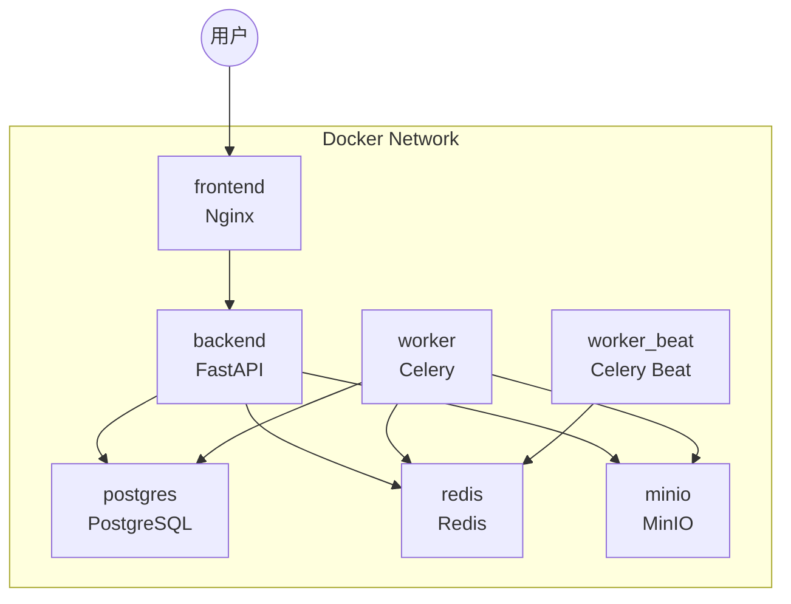

# ScriptForge 架构文档

## 系统架构

### 整体架构图

### AI 工作流架构

---

## 核心流程

### 业务流程图

---

## 质检系统详解

### 自动质检闭环流程

### 质检维度

| 质检器 | 检查维度 | 说明 |
|--------|---------|------|
| **Breakdown Aligner** | 剧情还原度 | 确保拆解结果忠实于原著 |
| | 剧情钩子 | 检查是否识别了所有剧情钩子 |
| | 冲突点提取 | 验证冲突点的完整性和准确性 |
| | 人物关系 | 检查人物关系的一致性 |
| | 场景识别 | 验证场景划分的合理性 |
| **Webtoon Aligner** | 剧情使用率 | 确保有效使用拆解的剧情点 |
| | 跨集连贯性 | 检查剧集之间的连贯性 |
| | 节奏控制 | 验证每集的节奏和张力 |
| | 视觉化风格 | 检查是否符合漫剧视觉化要求 |
| | 格式规范 | 验证剧本格式是否标准 |
| | 悬念设置 | 检查悬念和钩子的设置 |

---

## 配置驱动系统

### 动态配置架构

### 配置热更新流程

---

## 数据流向

### 文件与数据库双向同步

---

## 部署架构

### Docker Compose 部署

---

## 关键技术点

### 1. 异步任务处理

- **Celery**: 处理长时间运行的 AI 任务
- **WebSocket**: 实时推送任务进度
- **Redis**: 任务队列和消息代理

### 2. AI 模型适配

- **多模型支持**: OpenAI GPT-4、Anthropic Claude
- **适配器模式**: 统一的模型调用接口
- **温度参数**: 质检任务使用低温度 (0.3)，创作任务使用高温度 (0.7)

### 3. 质检闭环

- **最大重试次数**: 3 次
- **自动修正**: 根据质检反馈自动调整内容
- **降级策略**: 质检超时时保留已有结果

### 4. 批次处理

- **章节识别**: 自动识别小说章节
- **批次划分**: 每 6 章一个批次
- **顺序执行**: 批次间按顺序处理，确保连贯性

---

## 性能优化

### 数据库优化

- **索引**: 用户 ID、项目 ID、任务状态
- **连接池**: 异步连接池，大小 20
- **批量查询**: 减少数据库访问次数

### 缓存策略

- **配置缓存**: Redis 缓存 Skills/Agents 配置
- **进度缓存**: 任务进度实时缓存
- **TTL**: 配置缓存 5 分钟过期

### 并发控制

- **Worker 并发**: 每个 Worker 4 个并发任务
- **预取限制**: 预取 1 个任务，避免任务堆积
- **任务超时**: 硬超时 30 分钟，软超时 25 分钟

---

## 安全机制

### 认证与授权

- **JWT Token**: 基于 JWT 的用户认证
- **Token 过期**: Access Token 2 小时，Refresh Token 7 天
- **密码加密**: bcrypt 哈希存储

### API 安全

- **CORS**: 白名单域名访问控制
- **Rate Limiting**: API 请求频率限制
- **输入验证**: Pydantic 模型验证

### 数据安全

- **环境变量**: 敏感配置通过 .env 管理
- **SQL 注入防护**: SQLAlchemy ORM
- **XSS 防护**: 前端输入转义